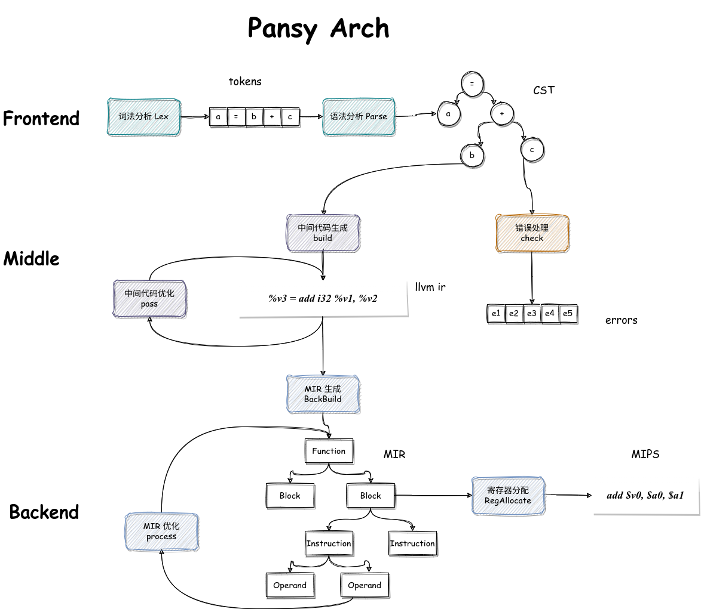

 # Pansy

一个简单的编译 SysY 语言（C 语言子集）到 Mips 的编译器，采用 Java 实现，由北航 2020 级学生 Thysrael 开发。

“pansy“ 为“潘西”的音译。潘西，为南京地方方言。有一说作“盼兮“，又一说与潘安有关。

> 巧笑倩兮，美目盼兮。	-- 《诗·卫风·硕人》
>
> 红绡裹下樱桃颗，好待潘车过巷西。	-- 《桃花扇》 	

“pansy” 的英文的释义是三色堇，紫色的三色堇有“思念”之义。所以综合来看，我大概想表达的意思，就是“我的姑娘啊，我在想你呀”之意。

“pan-“ 作为前缀，有“扩大，泛化”之意，“sy” 又与本编译器涉及的源语言相关。也算是切题了。


## Build

```shell
make build # 编译并在 auto 中打包成 jar
make clean # 清除临时文件
make zip   # src 源程序打包
make ir	   # 在 llc 中运行 llvm_ir.txt 中的源码
make mips  # 运行 mips.txt 中的源码
make run   # 自动测试，具体的需求需要自己配置
```

## Architecture

架构如图



文件结构如图


## Thanks

徐哥哥，林姐姐，传哥，泽哥，win 神。

香老师。
