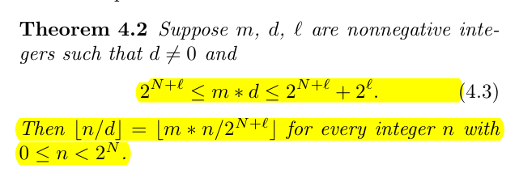
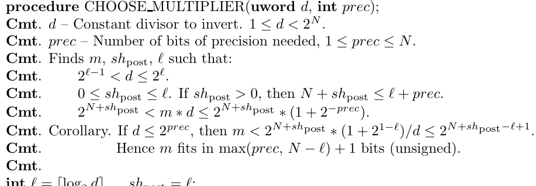

# 代码优化

## 1 个人信息

| 条目     | 内容       |
| -------- | ---------- |
| 学号     | 20373249   |
| 姓名     | 强生       |
| 年级     | 2006       |
| 学院     | 计算机学院 |
| 竞速排名 | 2          |

## 2 总论

​	我个人认为，优化分为两类，一类是分析型优化，这种类型的优化并不会改变 llvm ir 的结构，所以也不会有实际的优化效果，但是它们分析出来的信息，会去指导加工型优化的进行。另一种是加工型优化，这种优化会真正改变 llvm ir 的结构，达到优化的目的。

​	需要注意的是，分析和加工都不是只进行一次就可以的，加工型优化会改变 llvm ir 的结构发生改变，这就导致可以进行新的分析信息，而新的分析信息也就可以指导新的加工优化，这是一个周而复始的过程，这也是经典的 `DomAnalyze-SideEffectAnalyze-GVN-DCE-GCM-BranchOpt` 不动点循环的由来。最后的 `BranchOpt` 会改变 CFG 图，导致支配信息和副作用信息发生变化，这就可以指导进一步的加工型优化。

## 3 支配分析

​	在进行很多分析之前，都需要进行支配分析，这是因为支配树会提供很多的支配流信息，尤其是数据是怎样在数据块中流动，哪些数据必然从这个块流入另一个块，可以说，支配信息是对于 CFG 图的一种高度凝练的表达。

​	在求解支配树的时候，分为两步，第一步首先支配者和被支配者，这是一个不动点问题，利用的公式是
$$
temp = {index} \cup (\bigcap_{j \in preds(index)} domer(j) )
$$
​	需要一直求解到不发生变化为止。

​	第二步是计算支配边界，构造支配树，支配树是比原来的支配图更加直观而且“强”的条件，我们在优化中一般也是使用支配树的信息条件。所谓支配边界，就是恰好不被支配的一个块。

​	需要强调，支配树不仅应用在编译领域，这是一个很常见的图论算法，所以可以在网上找到详实的资料，所以对于算法问题就不赘述。

​	支配分析基于 CFG图会被用在 LoopInfoAnalyze， mem2reg，GVN 中，所以只要 CFG 发生改变，就会需要重新分析。

## 4 循环分析

​	虽然没有做专门的循环优化，但是 GCM 会需要利用循环深度信息，所以还是需要进行循环分析。循环是多种块组成的一种结构，比较重要的块有

- 循环头块，位于循环内部，一个循环有且仅有一个头块，一个头块可以被多个循环拥有。
- 闩锁块，位于循环中，其中有一个后继是头块

​	在循环分析中，我们是为了构建一棵循环森林，每个循环节点都是一组组成循环的块，内层循环是外层循环的子节点。我们发现循环的方式是按照支配树的后续遍历结果寻找栓块，这是为了先提内循环，后提外循环，这是因为内循环是受到外循环的头块的支配（循环头支配循环体）。闩块的判断标准是如果某个块直接支配它的前驱块，那么前驱块就是闩块。当我们登记完闩块后，就可以根据闩块寻找每一个循环。最后再补充循环之间的父子关系即可。

​	循环分析会用到支配分析，同时会在 GCM 和寄存器分配的时候使用。

## 5 函数调用分析

​	如果在调用者和被调用者之间构建一条有向边，那么就可以构建一个函数调用图，函数调用关系主要是为了后面的副作用分析，无用函数删除，函数内联做准备。在实际应用中，一般不会单独作为一个 pass ，这是因为这个用的很多，基本上是随用随做。

​	因为 SysY 并不支持函数声明，所以其实不会出现循环递归或者其他的阴间情况，这无疑对后面是一个好消息。

## 6 副作用分析

​	所谓的副作用（SideEffect），其实没有一个明确的概念，大概就是我们不喜欢的作用，就会被叫做副作用。在中端的副作用，指的是某个指令或者函数，会不会对内存或者 IO 造成影响，如果不会，那么就是没有副作用的。

​	没有副作用的东西很良好，因为他们造成的唯一影响只能通过返回值，所以如果返回值没有用到，那么这个东西就可以去掉了。不仅仅是去掉这么暴力，如果没有副作用，相当于有了一个很“强”的条件保证，我们对于某些优化的进行会变得更加自信，比如说一个函数如果没有副作用，我们就可以直接把他当成一条指令处理，对于

```javascript
%v1 = call i32 f(%a1);
%v2 = call i32 f(%a1);
```

​	我们可以直接判断 `v1 == v2` 是很好的东西。

​	进行副作用分析的时候，需要先构建一个函数调用关系图，这是因为有的函数本身并不会造成副作用，但是他调用的函数就会有副作用，导致调用这个函数也会有副作用。

​	我们一般认为这几个东西有副作用

- store 指令
- call 内联函数
- call 有副作用的函数

​	副作用分析会被用在 GVN，GCM ，DCE 中。

## 7 Mem2reg

​	mem2reg 可以将内存形式的 SSA 转变成真正比较好理解的 SSA，但是需要注意的是，mem2reg 并非只有这一个功能（我之前一直认为它只是插入 phi 节点），它其实是对于访存的一次彻底的优化。我们需要讨论的东西也就更多。

​	mem2reg 会对 ir 做出两点修改，其中是用 load 指令直接替换，同时删掉对应的 alloca 指令。另一个就是插入 phi 指令。在具体的实现上，需要用到支配信息，求解支配边界的闭包。

​	一个基本块的开始需要插入一个变量的 phi 节点的条件，是这个基本块是这个变量某个定义的支配边界。这个操作需要迭代，事实上就只需要建立一个队列，每次取出队首，计算其支配边界，并把新算出的支配边界插入到队列的末尾。注意，这时的 phi 节点还是空的，即只有左值没有右值。

## 8 Global Value Number

​	全局值编号。首先理解值编号，就是如果某个值等价于某个表达式，那么就给表达式一个编号，当再次出现这个表达式的时候，就可以发现这个编号是相同的，然后就可以替换成之前的那个值。

​	在 llvm 中，因为值和表达式是不分家的：

```javascript
%v1 = add i32 %a1, %a2
```

​	所以 `%v1` 就可以看成值编号（这里的理解会稍微有些难度）也就是真正查表的时候，需要这样查

```java
/**
     * 最关键的方法，查找 valueNumber
     * @param lookUp 查询 value
     * @return 一个可以用的 value
     */
private Value findValueNumber(Value lookUp)
{
    // 通过遍历查找
    if (valueNumberTable.containsKey(lookUp))
    {
        return valueNumberTable.get(lookUp);
    }

    // Not found, add
    Value allocatedValue = allocateNumber(lookUp);
    valueNumberTable.put(lookUp, allocatedValue);
    return allocatedValue;
}
```

​	对于表内没有对应编号的 Value，需要为他们分配一个编号（如果实在分配不出来，那么编号就是他们自己），但是有些情况会用别的编号，比如说计算指令，如果两个操作数相同，那么就是相同编号，`GEP` 也有这个效果，如果 `Call ` 一个无副作用的函数，只要实参相同，那么就分配相同的编号。

​	全局值编号就是维护一个全局的编号表用于查询，这种形式有些激进，因为 GVN 可能消掉位于不同分支上的相同表达式，但是这个问题会被 GCM 修正，所以 GVN 必须绑定 GCM。

​	同时还需要注意，GVN 需要遍历基本块，不同的遍历顺序会导致不同的编号结果，显然我们希望尽可能的在使用点前遍历到定义点，这样才有标号的意义，但是并不是总尽如人意的。我选择的是逆序遍历 CFG 图，然后逆序遍历，这是书上的参考方法，后续遍历会保证尽可能在遍历父节点前遍历子节点，逆序后就是先遍历父节点，那么自然定义会先于使用。但是似乎更好的方法是对于支配树前序遍历。这里我没有实现，不敢妄加讨论。

## 9 指令化简 && 运算强度削弱

​	夹杂在 GVN 中进行，这是因为指令化简可以给 GVN 创造更多的机会。比较常见的指令化简是常数替换，比如说将

```javascript
%v1 = add i32 %1, %2
```

​	将所有的 `%v1` 都用 `3` 替代。

​	除此之外，还可以进行一定的运算强度削弱，比如说

```
%v1 = mul i32 %v2, 2
```

 	换成

```
%v1 = add i32 %v2, %v2
```

再比如说

```
%v1 = add i32 %v2, 0
```

直接用 `v2` 替换 `v1`。

​	然后还有更加激进的优化，比如说对于

```js
%v1 = add i32 %v2, 
%v3 = add i32 %v1, 1 
```

​	是没法优化的，但是他其实描述的就是
$$
v3 = (v2 + 1) + 1
$$
那么我们可以考虑多生成一条冗余指令

```js
%v4 = add i32 1, 1
```

​	然后发现优化空间，最后优化成

```js
%v1 = add i32 %v2, 2
```

​	但是因为这条指令能否优化是不确定的，所以我们一定会生成冗余指令，这就需要死代码删除来帮助我们删掉这些冗余指令。

## 10 Dead Code Emit

​	所谓的死代码，就是不会对程序造成影响的代码，我们可以用与“副作用分析”类似的眼光去看，所有的访存指令，return 指令，call 一个有副作用的函数，分支指令，这些东西都是有用的，我们不能删除，那么这些指令使用到的指令，同样也是不能删除的，以此类推，这样求出一个**有用指令的闭包**，所有不在这个指令闭包内的指令，都是死代码，是可以删除的。

## 11 Global Code Motion

​	对于大多数指令结点，它们现在处于的基本块都是由源程序直译出来的，现在它们的控制依赖关系体现出来的控制流图结构并不是最佳的，甚至因为前面执行过的某些优化（比如全局值编号）可能还是错的。我们需要一种方式，将结点的海洋重建成我们需要的 CFG，它应当是**正确**的（体现在基本块中的每个指令的每个操作数都能够支配当前基本块），同时是**高效**的（体现在每个指令所位处的循环嵌套深度最浅），这种方法就是全局代码提升。

​	重建 CFG 的好处倒是显然的，毕竟它是许多优化算法的结构基础。对于我们的编译器，由于前端解析的时候构造过 Module 的基本块结构，因此完成这个结点归位的工作倒不是什么难事。

​	Cliff Click 给出了一个直接的近线性时间算法来完成全局代码移动 (GCM) ，算法将代码从循环中提取出来，并将其插入更依赖于控制的 (同时，可能执行频率更低) 基本块中。GCM 不是最优的，因为它很有可能会延长一些路径。它会使依赖于控制的代码脱离循环，因此如果循环至少执行一次，那么这种算法就是有利可图的。GCM 只依赖于指令之间的依赖关系（因为是基于支配树的），在执行算法时，原始的调度顺序将被忽略。

​	GCM 会移动指令，但它不改变控制流图 (CFG) ，也不删除冗余代码。GCM 受益于 CFG 整形(如分离控制相关的边，或插入循环的 landing pads)。GCM 允许我们为全局值编码 (GVN) 使用一种简单的基于哈希的技术，因此 GCM 和 GVN 优化往往是同时进行的。

## 12 函数内联

​	函数内联的思想没有 GVN，GCM 那么抽象，很显然，只需要将被调用的函数接入到原来调用他的函数中即可。但是还是有一些点需要注意的。

​	首先因为调用可能调用多次，所以需要每次都复制一遍函数，其次，对于多个 return 的情况，需要利用 phi 指令保证正确性，最后，对于形参，需要替换成实参，这要求 SSA 形式。

## 13 全局变量局部化

​	因为全局变量的访问需要在 llvm 中访存，比较低效，所以考虑对于只被一个函数使用了的全局变量（这就没有意义是全局的了），将其移入成局部变量。

## 14 乘法优化

​	乘法可以被优化成加法和移位操作，因为乘法的代价是 4，所以加法和移位操作最多有 3 条，那么考虑“移位-加法-移位”的组合，那么也就是可以拆出两条移位指令，那么可以枚举 32 位内由上述组合可以达到的组合，然后记录下来。

​	在乘法运算的时候，可以按照事先准备的进行操作。

## 15 除常数优化

### 15.1 除常数优化的定义

​	对于任何处理器，进行除法计算所需要的时间都远远高于乘法和移位运算（当然这两者也不在一个量级上），所以我们有一种想法，就是把除法转换成乘法和移位操作，也就是
$$
\tt{quotient = \frac{dividend}{divisor} = (dividend \times multiplier) >> shift}
$$
​	这个式子是一个很容易看懂的式子，不幸的是，这个式子是没有办法直接应用到我们的处理器上的。

​	如果想要应用到我们的处理器上，需要做出很多的妥协和让步，本文其实是一篇论文的注释，对于具体内容，大家可以参考论文：**Division by Invariant Integers using Multiplication**。

### 15.2 第 1 次溢出

​	在机器上计算与数学计算最大的一个区别就是机器上的位宽是有限的，所以会存在溢出问题，我们可以审视一下在这个问题里哪里会有溢出问题。

​	一个 32 位的除法是不会溢出的，商一定是一个 32 位以内的数，加减法是会溢出的，但是不是我们考虑的重点。乘法是会溢出的，也就是说 32 位的两个数相乘，积可能大于 32 位，所以我们才会在乘法计算中设置 Hi 和 Lo 两个寄存器，分别保存积的高 32 位结果和低 32 位结果。那么让我们审视变化中有一个结构
$$
\tt{(dividend \times multiplier)}
$$
​	这个东西有可能是一个大于 32 位的结果，所以我们必须选择挑选到底是 hi 还是 lo 作为上面这个的结果。那么结果十分显然，一定要挑 hi，这是因为 lo 有可能不对，而 hi 就没有这种顾虑。

​	如果我们使用 Hi，那么就要保证上面的积一定是一个极大的数，一定要到 32 位以上，不然就没有意义了，如果我们不能保证 `dividend` 的大小，但是我们可以保证 `multiplier` 在一个很大的范围，这样就可以让两者的乘积超过 32 位。

​	在采用了上面的思想后，我们的目标变成了
$$
\tt{\lfloor \frac{dividend}{divisor} \rfloor = \lfloor \frac{dividend \times multiplier}{2 ^ {N + shift}} \rfloor}
$$
​		其中 $N = 32$ 是机器字的字长。这个式子基本上就是真正的原理式了。

​		而反映到处理器上，就是以下的指令（指令用大写字母表示）
$$
\tt{SRL(MULUH(dividend, multiplier), shift)}
$$

### 15.3 第 2 次溢出

​	不幸的是，因为我们希望第 1 次溢出，所以我们会把 `multiplier` 调整的很大（具体的调整方法后面介绍），有的时候就超过了 32 位字长可以表示的程度，那么就会导致没办法用 32 位的寄存器存储，发生了第二次溢出。

​	那么为了让过大的 `multiplier` 可以被正确的计算，我们需要利用乘法分配律进行计算，有
$$
\tt{dividend \times multiplier = dividend \times (2^{N} + multiplier - 2^{N}) = (dividend << N) + dividend \times (multiplier - 2^{N})}
$$
​	反应到处理器上，就是以下的指令
$$
\tt{SRL(ADD(dividend, MULUH(dividend - 2^{N}, multiplier)), shift)}
$$
​	当计算出 `multiplier` 之后，我们需要对其大小进行一个判断，然后选择用哪种式子。

### 15.4 第 3 次溢出

​	当我们发生了第 2 次溢出后，我们采用了如下措施
$$
\tt{(dividend << N) + dividend \times (multiplier - 2^{N})}
$$
​	但是我们没有意识到加法同样是可能溢出的，所以我们还需要进一步修正，但是我懒得写咋修正了（依然是利用乘法分配律），因为在最终代码中没有体现（这是应为现在讨论的是无符号数，而有符号数的范围会比较小，所以没有这个问题）。

### 15.5 向零取整

​	对于有符号数来说，C 语言的特性是这样的，除法是向零取整的，也就是说 `3 / 4 = 0, -3 / 4 = 0`。但是对于位移来说，是向下取整的，也就是说 `3 >> 2 = 0, -3 >> 2 = -1`。因为我们用左移代替了除法，所以我们需要对于这里进行一定的修正。一共有两种修正，一种是对于除数是 2 的幂次的情况，那么我们修改被除数：
$$
\tt{newDividend = oldDividend + divisor - 1}
$$
​	另一种就是除数不为 2 的幂次，对于有符号除法，有如下公式（证明就不列了）


​	其中 $\tt{TRUNC}$ 是向零取整的意思。

### 15.6 选择 Multiplier 和 Shift

​	这就要涉及一些神秘的数学证明了，在证明开始之前，我觉得先说一下咱们需要干啥，现在我们需要根据 `divisor` 来确定 `multiplier` 和 `shift` ，但是显然一个数没法确定两个数，所以我们要挑出 `multiplier` 和 `shift`。但是也不能瞎挑，我们要保证我们挑出的东西是可以满足底下这个效果的
$$
\tt{\lfloor \frac{dividend}{divisor} \rfloor = \lfloor \frac{dividend \times multiplier}{2 ^ {N + shift}} \rfloor}
$$
​	待会要证明的东西就是一个“挑“ 的指导方针，大致是这个



​	证明就不写了，因为懒，而且背不过。

### 15.7 精度

​	待会的源码里还会有精度 `precision` 的说法，但是我对于这个东西的理解很肤浅，所以就不说了，论文中说的也不多，而且在有符号数里没有太多的用到，大致是这样的



## 16 窥孔优化

窥孔优化在后端进行，有如下几种形式

```java
/**
     * 处理的是加减法第二个数为 0 的情况，有
     * add r0, r1, 0 => mov r0, r1
     * add r0, r0, 0 => null
     * sub 同理
     */
 /**
     * 处理的是 mov 指令源和目的寄存器相同的情况
     * mov r0, r0 => null
     */
/**
     * 处理的是两个 mov 时的赋值覆盖问题
     * mov r0, r1 (cur, remove)
     * mov r0, r2
     */
/**
     * 判断的是
     * j block_label => null
     * block_label:
     */
/**
     *   store a, memory
     *   load b, sameMemory
     *   =>
     *   move b, a
     */
```

## 17 数据流窥孔

​	这个数数据流窥孔的最重要的分析方法，它以基本块为单位进行分析。最终我们获得的是一个 writerToReader 的映射，这个映射可以根据一个写指令去查询最后一次的与之相关的读指令，之所以这个映射有用，是因为我们在数据流窥孔中会删除写指令或者改变写指令，而一旦改变，后面的读指令也应当发生改变，只有当写指令与读指令的距离小于窥孔的直径的时候，才是可以更改的。