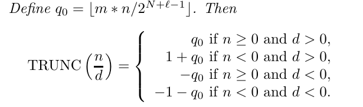

# Pansy 潘西 -- SysY 语言编译器

[TOC]

## 零、个人信息

| 条目     | 内容       |
| -------- | ---------- |
| 学号     | 20373249   |
| 姓名     | Thysrael   |
| 年级     | 2006       |
| 学院     | 计算机学院 |
| 竞速排名 | 2          |

----


## 一、参考编译器介绍

​	参考的编译器主要是是 `Coredump` 、 `Anlnmc`、`MIPSysY-Compiler`、`MipsCompiler`。

​	对于 `Coredump` 编译器，这是我 2022 年编译比赛时搭建的编译器，获得了三等奖的成绩。在搭建 `Coredump` 的时候，我设计了其整体架构，而且实践证明这个架构还算结实、可拓展性强。架构中将编译器分为**“前端-中端-后端”**的思想我并没有对其进行修改。其架构如图所示。


​	对于 `Anlnmc` 编译器，是我的好朋友陈凝香、温佳昊、欧阳皓东和唐熙程在 2022 年编译比赛时搭建的编译器，同样获得了三等奖的成绩。因为比赛时我们两队沟通频繁，所以架构相差不大，我主要借鉴了他们的中端优化思想，因为队伍的算法水平比较高，所以在生成 `llvm` 和中端代码优化部分的代码和设计思想更加简洁优雅，所以我主要吸纳了他们的算法思想。

​	对于 `MIPSysY-Compiler`、`MipsCompiler` 编译器，分别为 19 级叶焯仁和陈昊学长的代码，但是由于他们的架构设计与我的架构设计相差过大，我主要是通过阅读他们的代码在架构设计中起到一个**对照思考**的效果。比如说在词法分析时，陈学长按照书上的方法对 Token 进行了分类，但是我个人认为叶学长每个 Token 一类的方式更加适合应试；在语法分析的时候，陈学长在语法分析的过程中进行了部分的语义分析，这导致了一定的高耦联现象；叶学长独立的进行了语法分析，然后进行了两遍语义分析，这样耦合性降低了，但是高内聚又有一定的缺失。因此在我设计的时候，我独立的进行了一遍语法分析，又进行了一遍语义分析，可以说是尽量吸取前人的经验。同时不可否认，两位学长的的 Java 码风和 OO 思想都是极佳的，通过阅读他们的代码，我感觉我的代码水平得到了一定的提高。

​	需要再次强调，这些参考编译器的作者我都十分尊敬，十分感谢他们搭建了这么好的编译器，每当阅读他们的代码的时候，我都心旷神怡，觉得高山仰止。十分感谢他们给了我这个学生一个进步的机会。万分感谢！

---


## 二、编译器总体设计

​	一个简单的编译 SysY 语言（C 语言子集）到 Mips 的编译器，采用 Java 实现，由北航 2020 级学生 Thysrael 开发。“pansy“ 为“潘西”的音译。潘西，为南京地方方言。有一说作“盼兮“，又一说与潘安有关。

### 2.1 总体架构

​	总体架构采用“前端-中端-后端”的架构形式，其中前端包括词法分析和语法分析，中端包括错误处理、中间代码生成和中间代码优化，其中中间代码为 llvm。后端包括 MIR 生成，MIR 优化和寄存器分配。架构设计图如下：


### 2.2 接口设计

​	不同的功能模块之间需要沟通，沟通的媒介就是不同的数据结构在我的理解中，接口设置主要分为两大类，一类是“向后负责”，也就类似于 `toString, toJson` 之类的方法，上游的模块会将数据结构加工成下游模块需要的样式；一类是“向前负责”，也就是类似于 `parse` 之类的方法，下游的模块会解析上游的数据结构，将其翻译成自己需要的样式。

​	这两种方法并没有实质性的区别，工作量是一样的，因为本质上都是两种数据结构的转换，在上游完成还是下游完成，没啥区别。

​	具体的接口层有四层（其他的数据结构转换也是存在的，只是没有那么明显），涉及的是

- Tokens -> CST：向前负责，有一个统一的 Parser 用于生成 CST。
- CST -> LLVM IR：向后负责，CST 的每个节点实现了相应的 irBuild。
- CST -> Errors：向后负责，CST 的每个节点实现了相应的 check。
- LLVM IR -> MIR：向前负责，有一个统一的 IrParser 用于生成 MIR。

### 2.3 文件组织

​	文件组织图如下所示


​	Pansy 项目的代码量统计：


​	Pansy 源码的代码量统计：


---


## 三、词法分析设计

### 3.1 编码前的设计

#### 3.1.1 正则表达式的应用

​	对于一个词法分析机 `Lexer` 来说，可以将其视为一个有限状态自动机，但是这个自动机极其复杂，所以可以考虑对于每种 token 分别设计状态机，然后将这些小的状态机并联起来，就可以获得一个完整的状态机，也就是如下结构


​	又因为正则表达式在数学上和一个状态机等价，所以可以用这种形式构造 `Lexer`：

```java
regex1|regex2|regex3|...|regexn
```

​	我的架构相对于这个架构没有首字符判断，而是直接采用正则表达式进行分类，所以需要更加细致的优先级比较。

#### 3.1.2 完全的自动机

​	这个问题来自于与肖哥哥的一次讨论的结果，我们讨论的主题是“对于源文件的读入，是处理成一个字符串，还是按照换行分处理成一个字符串数组”。我一开始持“数组观点”。但是后来经过思考，我觉得还是按照一个字符串读入更加具有数学美感。

​	因为除了常见的分类，我们还有一些需要处理的，没有出现在分类中的 `token`，比如空白符，注释。这些东西也可以用一个小的自动机识别，作为一个 `token` 。我们只是不登记它罢了。如果要按照数组的形式去读取，那么就会导致换行符等元素被直接翻译了，这就导致原文本变得不完整了，我们匹配的对象不再是源文件，而是源文件的一行，那么显然多行注释这种东西就没法匹配了。

​	如果按照一个字符串来处理，那么根据要求，就需要一个变量来记录目前到哪一行了，这个很容易，只需要确定一下每次匹配到的内容中有几个 `\n` 即可。

```java
token.getContent().chars().boxed().filter(c -> c == '\n').count();
```

​	这里再提一嘴 `/r/n` 的文字，在 windows 下，我们说的“换行啦”对应的是 `/r/n` 。其中 `/r` 的意思是将光标定位到行首，而 `\n` 是“换行”。但是如果按照正常的理性，那么 `/r/n` 应该是消掉最后一行的意思，但是又因为最后一行的行尾其实本质是下一行的行首，所以 `/r` 在末尾敲的时候，是没有用处的，所以就可以正常工作了。在 Linux 下，“换行啦”对应的是 `\n` 。

#### 3.1.3 单词分类与识别

​	这是我在进行架构设计的时候最为纠结的地方，因为要考虑数学的优雅性和上机的易于拓展性。

​	我们需要一个大的自动机去识别多种 `token`，这个目的需要一个很大的正则表达式，有很多个小的正则表达式连缀形成。但是这个的缺点就在于，当这个总的正则匹配上的时候，我并不清楚是哪一个小的表达式匹配上了。

​	对于这个问题，其实有两种思路，一种是放弃简单的**总正则表达式**，而是利用循环结构一个个的去匹配小的正则表达式。我没有采用这种想法，不过现在看起来，这种方法确实是最适合应试的一种方法，因为无论是优先级的设定，还是 `token` 的维护，都是最便捷的，而是实现难度极小（甚至还有一种暴力的数学美感）。但是多次匹配，不知道效率会不会降低。

​	另一个是使用完总表达式匹配完成后，再迭代各种单词的类别，然后确定到底匹配的是哪一个，确定的方法可以利用预先建立好的 `map`，但是其实有一些还是需要正则表达式匹配（数学上是必须的）。不过可以利用正则表达式的**命名组**来去掉这个过程。不过无论如何都避免不了内层的迭代。

​	我采用的是规规矩矩的书上的方法，先给单词进行一个大的分类，然后对于大分类，再写具体的正则。这种方法除了比较容易看懂以外，修改起来既要改大类，又要改小类，我觉得不是很好。为了一点点美感，需要改的地方增多了。

#### 3.1.4 匹配的优先级

​	比如说对于字符串 `<=` 。正则表达式 `"<"` 和 `"<="` 都可以匹配上，所以匹配的时候要注意优先级问题，其实只有两点，就是

- 长串优先匹配。这是对应上面描述的情况
- 保留字优先匹配。这是对应 `main1` 和 `main` 都可以匹配的情况。

#### 3.1.5 Token 的区分

​	不得不说，token 的识别还是有一定的难度的，不同的 token 因为含有相同的子串，或者其他原因，很容易在识别中就发生错误。除了上面的将 `<=` 识别成 `<, =` 两个符号之外，还有很多更加神奇的错误，比如说考虑加入了自增运算符 `++` 的语法中，1很容易将 

```c
a ++1; // 本质是 a + (+1)
```

识别成 `a, ++, 1` 。对于这个问题，可以考虑进一步前瞻，就是判断 `++` 后面出现的符号是什么，这就要求更加强大的匹配法则，所以在后面会介绍正则的**前瞻后顾**概念。

### 3.2 编码完成之后的修改

#### 3.2.1 正则栈溢出问题

​	最大的问题，据资料显示 Java 的正则是采用递归的形式实现的，这就导致当需要识别的 token 很大的时候（多行注释 500 行），会发生栈溢出，我担心字符串也有这个问题，所以将这里调整成了手写识别，而不是正则表达式。

#### 3.2.2 整体架构

​	之前的时候对于叶哥哥的架构设计借鉴颇多，在自己写的时候，发现用 int （即下标）而不是 boolean 来指示识别成功与否，更加的合理和自然，类似于 Java 中的 `String.indexof` 方法。这样的架构的自动机更加明确，基本上不会出现死循环。

#### 3.2.3 其他数制的实现

​	为了怕考试考到，所以提前用 anltr 试写了一遍其他数制的正则表达，如下所示

```java
intConst
    : DECIMAL_CONST
    | OCTAL_CONST
    | HEXADECIMAL_CONST
    ;

DECIMAL_CONST
    : [1-9]
    | [1-9] [0-9]+
    ;

OCTAL_CONST
    : '0'
    | ('0' [0-7]+)
    ;

HEXADECIMAL_CONST
    : ('0x' | '0X') [a-fA-F0-9]+
    ;

DECIMAL_FLOATING_CONST
    : FRACTIONAL_CONST (('e' | 'E') ('+' | '-')? [0-9]+)?
    | [0-9]+ (('e' | 'E') ('+' | '-')? [0-9]+)
    ;

HEXADECIMAL_FLOATING_CONST
    : ('0x' | '0X') HEXA_FRACTIONAL_CONST (('p' | 'P') ('+' | '-')? [0-9]+)
    | ('0x' | '0X') [a-fA-F0-9]+ (('p' | 'P') ('+' | '-')? [0-9]+)
    ;

FRACTIONAL_CONST
    : ([0-9]+)? DOT [0-9]+
    | [0-9]+ DOT
    ;

HEXA_FRACTIONAL_CONST
    : ([a-fA-F0-9]+)? DOT [a-fA-F0-9]+
    | [a-fA-F0-9]+ DOT
    ;
```

​	对于语义部分，似乎有一些方法辅助转化。

```java
int x = Integer.parseInt(str.substring(2),16);
Double.longBitsToDouble(0x40E01D0280000000L)
```

---


## 四、语法分析设计

### 4.1 编码前的设计

#### 4.1.1 具体语法树

​	`Parser` 的目的是为了根据语法获得一个**具体语法树**（Concrete Syntax Tree，CST）。这棵语法树的非叶子节点是各个语法成分，而叶子节点则是 `Token` （或者说包含 `Token`）。强调这个是因为我没有意识到可以将 `Token`  与其他语法成分等量齐观。

​	在文法中，我们约定非叶子节点采用首字母大写的驼峰命名法，比如 `CompUnit`，而对于叶子节点，我们采用全大写的形式，比如 `IDENFR` 。

#### 4.1.2 改写语法

手搓了一份 SysY 的文法，采用正则形式，写在了 `SysY.g4` 文件中。相比于课程组给出的文法，消除了左递归，并且严谨了表述。而且拓展了一部分十分不优雅的语法。

##### 编译单元 CompUnit

```
CompUnit -> {Decl} {FuncDef} MainFuncDef
```

编译单元由声明，函数定义和主函数定义组成，而且必须保持这个顺序，我修改成了

```
CompUnit
   : (FuncDef | Decl)+
   ;
```

这样声明和函数可以交错，而且不会有 `MainFuncDef` 这个选项。识别的时候依靠前瞻即可。

##### 声明 Decl

```
Decl → ConstDecl | VarDecl 
```

声明可以是常量声明或者变量声明

```
Decl
   : ConstDecl
   | VarDecl
   ;
```

这部分没有修改。

##### 常量声明 ConstDecl

```
ConstDecl → 'const' BType ConstDef { ',' ConstDef } ';' 
```

主要修改是增加了 token 节点，避免了 token 的暴露，让后序遍历更加一致。而且去掉了 `BType`

```
ConstDecl
   : CONST_KW BType ConstDef (COMMA ConstDef)* SEMICOLON
   ;
```

可以看到，常量声明可以用逗号分割，同时声明多个。

##### 常量定义 ConstDef

```
ConstDef → Ident { '[' ConstExp ']' } '=' ConstInitVal
```

修改成

```
ConstDef
   : IDENFR (L_BRACKT ConstExp R_BRACKT)* ASSIGN ConstInitVal
   ;
```

基本上没有任何变化。

##### 常量初值 ConstInitVal

常量初值可以是一个常量表达式，也可以是一个数组初值

```
ConstInitVal → ConstExp
			 | '{' [ ConstInitVal { ',' ConstInitVal } ] '}'
```

##### 常量表达式 ConstExp

```
ConstExp → AddExp
```

最终 `ConstExp` 会变成 `AddExp` 。`Exp` 也是会推出 `AddExp`。其中的区别是 `ConstExp` 里不能有变量。

修改为

```
ConstExp
    : AddExp
    ;
```

##### 变量声明 VarDecl

```
 VarDecl → BType VarDef { ',' VarDef } ';'
```

修改为

```
VarDecl
    : BType VarDef (COMMA VarDef)* SEMICOLON
    ;
```

##### 变量定义 VarDef

```
VarDef → Ident { '[' ConstExp ']' } 
	   | Ident { '[' ConstExp ']' } '=' InitVal //包含普通变量、一维数组、二维数组定义
```

相比于常量定义必须有初值，变量定义可以没有初值，修改为

```
VarDef
    : IDENT (L_BRACKT ConstExp R_BRACKT)* (ASSIGN InitVal)?
    ;
```

基本上没变。

##### 变量初值 InitVal

```
InitVal → Exp 
	    | '{' [ InitVal { ',' InitVal } ] '}'
```

可以是单变量，也可以是数组。可以修改为

```
InitVal
    : Exp
    | (L_BRACE (InitVal (COMMA InitVal)*)? R_BRACE)
    ;
```

基本上没变。

##### 函数定义 FuncDef

```
FuncDef → FuncType Ident '(' [FuncFParams] ')' Block 
```

函数由函数类型，标识符，形参列表和函数体组成，SysY 中没有函数声明，只有函数定义。

```
FuncDef
   : FuncType IDENT L_PAREN funcFParams? R_PAREN block
   ;
```

这里的函数定义包括主函数 `main`。

##### 函数类型 FuncType

```
FuncType → 'void' | 'int' 
```

修改为

```
FuncType
    : VOID_KW
    | INT_KW
    ;
```

##### 函数形参表 FuncFParams

```
FuncFParams → FuncFParam { ',' FuncFParam } 
```

函数形参表至少有有一个参数，没参数的情况是直接没有形参表。修改为

```
FuncFParams
    : FuncFParam (COMMA FuncFParam)*
    ;
```

##### 函数形参 FuncFParam

```
FuncFParam → BType Ident ['[' ']' { '[' ConstExp ']' }] 
```

参数可以是整型，还可以是数组，但是数组的第一维一定是缺失的。

```
FuncFParam
    : BType IDENT (L_BRACKT R_BRACKT (L_BRACKT Exp R_BRACKT)*)?
    ;
```

##### 语句块 Block

```
Block → '{' { BlockItem } '}'
```

语句块就是花括号包裹的 0 到多个 `BlockItem` 。修改为

```
Block
    : L_BRACE BlockItem* R_BRACE
    ;
```

##### 语句块项 BlockItem

```
BlockItem → Decl | Stmt 
```

语句块项可以是声明和语句。修改为

```
BlockItem
    : VarDecl
    | Stmt
    ;
```

##### 语句 Stmt

```
Stmt → LVal '=' Exp ';' // 每种类型的语句都要覆盖
| [Exp] ';' // 有无Exp两种情况
| Block
| 'if' '(' Cond ')' Stmt [ 'else' Stmt ] // 1.有else 2.无else
| 'while' '(' Cond ')' Stmt
| 'break' ';' 
| 'continue' ';'
| 'return' [Exp] ';' // 1.有Exp 2.无Exp
| LVal '=' 'getint''('')'';'
| 'printf''('FormatString{','Exp}')'';' // 1.有Exp 2.无Exp
```

这里似乎过于复杂了，所以尝试引入多个来缓解。不过需要注意，即使引入了多个，其实本质还是一个语句，所以语法成分不会增多。

语句总览：

```
Stmt
    : AssignStmt
    | ExpStmt
    | Block
    | ConditionStmt
    | WhileStmt
    | BreakStmt
    | ContinueStmt
    | ReturnStmt
    | InStmt
    | OutStmt
    ;
```

###### 赋值语句 AssignStmt

```
AssignStmt
    : LVal ASSIGN Exp SEMICOLON
    ;
```

###### 表达式语句 ExpStmt

```
ExpStmt
    : Exp? SEMICOLON
    ;
```

​	可以发现 `AssignStmt` 和 `ExpStmt` 有很大的重复部分，比如 `a[1][1];` 和 `a[1][1] = 1;` 就是两个语句，但是除非解析到 `=` ，否则根本分不出来到底是啥，所以可能需要前瞻很多东西。

###### 输入语句 InStmt

```
InStmt
	: LVal ASSIGN GETINTTK L_PAREN R_PAREN SEMICOLON
```

​	发现似乎需要和 `AssignStmt` 一起处理。应该没事。

###### 输出语句 OutStmt

```
OutStmt
    : PRINTFTK L_PAREN FormatString (COMMA Exp)* R_PAREN
    ;
```

###### 条件语句 ConditionStmt

​	有趣的是，这些复杂的结构，我以为是翻译成 `Block`，但是却被翻译成了 `Stmt`。确实这样表达能力增强了。

```
ConditionStmt
    : IF_KW L_PAREN Cond R_PAREN Stmt (ELSE_KW Stmt)?
    ;
```

###### 循环语句 WhileStmt

```
WhileStmt
    : WHILE_KW L_PAREN Cond R_PAREN Stmt
    ;
```

###### 跳出语句 BreakStmt

```
BreakStmt
    : BREAK_KW SEMICOLON
    ;
```

###### 继续语句 CotinueStmt

```
ContinueStmt
    : CONTINUE_KW SEMICOLON
    ;
```

###### 返回语句 ReturnStmt

```
ReturnStmt
    : RETURN_KW (Exp)? SEMICOLON
    ;
```

##### 条件表达式 Cond

```
Cond → LOrExp
```

修改为

```
Cond
    : LOrExp
    ;
```

##### 逻辑或表达式 LOrExp

```
LOrExp → LAndExp | LOrExp '||' LAndExp
```

需要消去左递归，修改为

```
LOrExp
   : LAndExp (OR LAndExp)*
   ;
```

这样看就很显然了，因为 `OR` 优先级是低于 `AND` 和 `NOT` 的，所以把他放在最外侧。

##### 逻辑与表达式 LAndExp

```
LAndExp → EqExp | LAndExp '&&' EqExp 
```

修改为非左递归形式，如下

```
LAndExp
    : EqExp (AND EqExp)*
    ;
```

这依然维持着优先级的构造顺序，优先级由高到低排列

- 一元运算符：`!, +, -`
- 乘除运算符：`*, /, %`
- 加减运算符：`+,  -`
- 关系运算符：`<, <=, >, >=`
- 相等运算符：`==, !=`
- 逻辑与运算符：`&&`
- 逻辑或运算符：`||`

##### 相等性表达式 EqExp

```
EqExp → RelExp | EqExp ('==' | '!=') RelExp 
```

消去左递归，获得

```
EqExp
    : RelExp (EqOp RelExp)*
    ;
    
EqOp
    : EQ
    | NEQ
    ;
```

##### 关系表达式 RelExp

```
RelExp → AddExp | RelExp ('<' | '>' | '<=' | '>=') AddExp 
```

消除左递归，变为

```
RelExp
    : AddExp (RelOp AddExp)*
    ; // eliminate left-recursive

RelOp
    : LT
    | GT
    | LE
    | GE
    ;
```

##### 表达式 Exp

```
Exp → AddExp 
```

表达式直接为 AddExp，是一件十分神奇的事情，即使引入了浮点数计算，这里依然维持一个的对应关系。

```
Exp
    : AddExp
    ;
```

##### 加减表达式 AddExp

```
AddExp → MulExp | AddExp ('+' | '−') MulExp 
```

消除左递归，修改为

```
AddExp
    : MulExp (AddOp MulExp)*
    ; // eliminate left-recursive

AddOp
    : PLUS
    | MINUS
    ;
```

##### 乘除表达式 MulExp

```
MulExp → UnaryExp | MulExp ('*' | '/' | '%') UnaryExp 
```

消除左递归，修改为

```
MulExp
    : UnaryExp (MulOp UnaryExp)*
    ; // eliminate left-recursive

MulOp
    : MUL
    | DIV
    | MOD
    ;
```

##### 一元表达式 UnaryExp

```
UnaryExp → PrimaryExp 
		 | Ident '(' [FuncRParams] ')'
         | UnaryOp UnaryExp 

FuncRParams → Exp { ',' Exp } 
```

一元表达式并非分解的重点，因为还有一元运算符

```
UnaryExp
    : PrimaryExp
    | Callee
    | UnaryOp UnaryExp
    ;
    
Callee
    : IDENFR L_PAREN FuncRParams? R_PAREN
    ;
```

##### 基本表达式 PrimaryExp

```
PrimaryExp → '(' Exp ')' | LVal | Number
```

到这里，可以说开始递归了。基本表达式没有任何运算符，基准情况只有左值和字面量两种。

```
PrimaryExp
    : L_PAREN Exp R_PAREN
    | LVal
    | Number
    ;
```

##### 一元运算符 UnaryOp

```
UnaryOp → '+' | '−' | '!' 
```

修改为

```
UnaryOp
    : PLUS
    | MINUS
    | NOT
    ;
```

##### 左值表达式 LVal

```
LVal → Ident {'[' Exp ']'} 
```

修改为

```
LVal
    : IDENFR (L_BRACKT Exp R_BRACKT)*
    ;
```

##### 函数实参表 FuncRParams

```
FuncRParams → Exp { ',' Exp } 
```

修改为

```
FuncRParams
    : Exp (COMMA Exp)*
    ;
```

#### 4.1.3 表达式优先级

SysY 语言和 C 语言的优先级一致，我们在递归下降的时候，会利用优先级，如下所示

| 运算符         | 体现                                                         |
| -------------- | ------------------------------------------------------------ |
| `[], ()`       | 修饰 PrimaryExp，LVal 的一部分是 `[]`，Callee 的一部分是 `()` |
| `!, -, +`      | 修饰 UnaryExp                                                |
| `*, /, %`      | 修饰 MulExp                                                  |
| `+, -`         | 修饰 AddExp                                                  |
| `<, <=, >, >=` | 修饰 RelExp                                                  |
| `==, !=`       | 修饰 EqExp                                                   |
| `&&`           | 修饰 LAndExp                                                 |
| `||`           | 修饰 LOrExp                                                  |

### 4.2 编码完成之后的修改

#### 4.2.1 语法语义解耦连

​	在往届学长的代码中，出现了两种趋势，一种是在进行语法分析的时候进行大量的语义分析，当然这只是我个人的观点，我认为的语法分析是完全按照给出的文法进行的分析，稍微变动一点都叫做“引入语义分析“，其中最明显的就是郭衍培学长的语法解析部分，利用了递归下降法的同时使用了算符优先分析方法，导致他对利用语义对语法进行了大量的改写。还有一个方向是叶焯仁学长的方向，只进行单纯的递归下降，不过这一种甚至连一棵很好的树都没有建立（叶哥哥在后面进行了两次语义处理）。

​	我在实现的时候，将语义和语法完全解耦连，在 `parse` 中只按照文法进行解析，同时尽量记录全所有的语法信息，比如说之前我对于 CST 树节点（`AddExpNode`）是这样记录孩子的

```java
protected final ArrayList<CSTNode> children = new ArrayList<>();
```

​	可以看到是同质化的，对于 `AddExp` 来说，是没有办法区分孩子是操作数还是操作符的，这是不利于后续的语义分析的，所以之后修改为

```java
private final ArrayList<MulExpNode> mulExps = new ArrayList<>();
private final ArrayList<TokenNode> addOps = new ArrayList<>();

@Override
public void addChild(CSTNode child)
{
    super.addChild(child);
    if (child instanceof MulExpNode)
    {
        mulExps.add((MulExpNode) child);
    }
    else if (child instanceof TokenNode)
    {
        addOps.add((TokenNode) child);
    }
}
```

​	这样就可以更加方便的访问各种语法信息。

#### 4.2.2 向后负责的接口

​	这个主要是我本来打算让所有的接口设计都是向前负责的，但是我在实践中发现，如果要单开一个类去做错误处理和中间代码生成会导致一个类中有很多种方法（与文法左侧相当）。这可能会导致文件过长，同时不利于检索和理解设计（分模块）。

​	后来吸取了**语法制导翻译**的意义，考虑利用向后负责构建接口，这样每个节点都是继承 `CSTNode` 基类的子类，每个子类都会自发的重写 `buildIr(), check()` 和两个方法，分别用于中间代码生成和错处处理。如下所示

```java
/**
* 最基础的检测方法，就是检测让每个子节点进行检测
* @param symbolTable 符号表
*/
public void check(SymbolTable symbolTable)
{
    addCheckLog();
    for (CSTNode child : children)
    {
        child.check(symbolTable);
    }
}

public void buildIr()
{
    children.forEach(CSTNode::buildIr);
}
```

#### 4.2.3 错误处理修改

​	在普通的语法分析中，是可以按照递归下降解析的，对于比较难以分辨的

```java
Exp;
LVal = Exp;
```

​	可以依靠前瞻到 `=` 符号来区分两种不同的 `stmt` ，但是当引入错误后，缺少某些符号，有可能会导致解析方向的错误。所以需要进行“尝试解析”，如下所示

```java
ParseSupporter oldSupporter = this.supporter;
this.supporter = new ParseSupporter(oldSupporter);
try
{
    parseLVal();
    supporter.checkToken(SyntaxType.ASSIGN);

    if (supporter.lookAhead(0).isSameType(SyntaxType.GETINTTK))
    {
        this.supporter = oldSupporter;
        stmtNode.addChild(parseInStmt());
    }
    else
    {
        this.supporter = oldSupporter;
        stmtNode.addChild(parseAssignStmt());
    }
}
catch (PansyException e)
{
    this.supporter = oldSupporter;
    stmtNode.addChild(parseExpStmt());
}
```

​	需要先尝试解析 `AssignStmt ` 如果失败了，那么就变成解析 `ExpStmt` 。

---


## 五、错误处理

### 5.1 编码前的设计

#### 5.1.1 总论

​	错误处理和解析生成中间代码的过程是类似的，都可以看做是一个**语法制导翻译的过程**。对于遍历出的节点，触发不同的动作符号，这些动作符号在错误处理中用于检测错误，而在生成中间代码生成中，这些动作符号用于生成中间代码。

#### 5.1.2 错误的分类

​	并非所有的错误是语义错误（比如说变量重命名），还有的错误是语法错误，比如说缺失分号等。这些语法错误可以在 TokenNode 中进行检验，在语法解析的时候可以暂时帮他补上，然后最后再统一检测，如下所示

```java
/**
* 用于缺失的时候产生具体的 error
* 包括三种缺失错误
* 字符串错误
* 名字错误本来就不行，这是因为名字错误包括未定义和重复定义两种，没有办法确定要使用哪种
*/
@Override
public void check(SymbolTable symbolTable)
{
    // 检测缺失情况
    if (token.isSameType(SyntaxType.SEMICN))
    {
        if (miss)
        {
            errors.add(new PansyException(ErrorType.MISS_SEMICOLON, token.getLine()));
        }

    }
    else if (token.isSameType(SyntaxType.RBRACK))
    {
        if (miss)
        {
            errors.add(new PansyException(ErrorType.MISS_RBRACK, token.getLine()));
        }
    }
    else if (token.isSameType(SyntaxType.RPARENT))
    {
        if (miss)
        {
            errors.add(new PansyException(ErrorType.MISS_RPARENT, token.getLine()));
        }
    }
    // 检测是否是合法字符串
    else if (token.isSameType(SyntaxType.STRCON))
    {
        String content = token.getContent();
        // 不算两个双引号
        for (int i = 1; i < content.length() - 1; ++i)
        {
            int ascii = content.charAt(i);
            if (ascii == 32 || ascii == 33 || ascii >= 40 && ascii <= 126)
            {
                if (ascii == 92 && content.charAt(i + 1) != 'n')
                {
                    errors.add(new PansyException(ILLEGAL_SYMBOL, token.getLine()));
                    return;
                }
            }
            else if (ascii == 37)
            {
                if (content.charAt(i + 1) != 'd')
                {
                    errors.add(new PansyException(ILLEGAL_SYMBOL, token.getLine()));
                    return;
                }

            }
            else
            {
                errors.add(new PansyException(ILLEGAL_SYMBOL, token.getLine()));
                return;
            }
        }
    }
}
```

#### 5.1.3 左值类型

​	在传参的时候需要考察实参的类型和形参是否匹配，实参一般都是左值。对于类型检测，是十分简单的，他只要求比较维度，而不要求比较维度的具体信息，即下面的示意


​	所以可以考虑像计算实值一样计算计算类型，首先定义数据的类型

```java
public enum CheckDataType
{
    // 无返回值
    VOID,
    // 单变量
    INT,
    // 一维指针，比如说 int a[2] 中的 a，就是 DIM1， int a[] 也是 DIM1（本质是传入 a）
    DIM1,
    // 二维指针，比如说 int a[][2] 中的 a，就是 DIM2
    DIM2
}
```

​	然后进行计算，计算的方式是这样的，每次一个 `[]` 都会导致维度下降，而普通的计算式并不改变维度（这是因为我们有这样的语义约束），如果想要做得更好一些，可以规定他们的优先级，这样就可以进行隐式的类型转换，和 C 语言更加相似，如下所示

```java
private CheckDataType calcDataType(CheckDataType rawType)
{
    int calDim = exps.size();
    int rawDim;
    if (rawType.equals(CheckDataType.INT))
    {
        rawDim = 0;
    }
    else if (rawType.equals(CheckDataType.DIM1))
    {
        rawDim = 1;
    }
    else if (rawType.equals(CheckDataType.DIM2))
    {
        rawDim = 2;
    }
    else
    {
        rawDim = -1;
    }
    int trueDim = rawDim - calDim;
    if (trueDim == 0)
    {
        return CheckDataType.INT;
    }
    else if (trueDim == 1)
    {
        return CheckDataType.DIM1;
    }
    else if (trueDim == 2)
    {
        return CheckDataType.DIM2;
    }
    else
    {
        return CheckDataType.VOID;
    }
}
```

 隐式转换

```java
/**
* 获得数据类型
* 会遍历所有的孩子节点，然后找到最高的
* 如果没有的话，那么就会变成 VOID
* 合情合理有没有
* @param symbolTable 符号表
* @return 数据类型
*/
public CheckDataType getDataType(SymbolTable symbolTable)
{
    CheckDataType type = CheckDataType.VOID;

    for (CSTNode child : children)
    {
        CheckDataType childType = child.getDataType(symbolTable);
        if (childType.compareTo(type) > 0)
        {
            type = childType;
        }
    }

    return type;
}
```

### 5.2 编码完成之后的修改

#### 5.2.1 输出顺序

​	因为最后要求是要按照错误所在行的递增排列，并且要求保证每行只会出现一个错误，所以我用了 `TreeSet` 去实现排序和去重功能。

​	首先在 `PansyException` （我的错误类）中定义比较行数的函数

```java
/**
* 这里为了错误输出时按照顺序输出，所以需要比较所在行的大小
* @param other 另一个 exception
* @return 行数比较
*/
public int compareTo(PansyException other)
{
    return line - other.line;
}
```

​	然后将原来的 `error` 数组重新放到 `TreeSet` 中，然后输出：

```java
public String display()
{
    StringBuilder s = new StringBuilder();
    Set<PansyException> set = new TreeSet<>((o1, o2) -> -o2.compareTo(o1));
    set.addAll(errors);
    for (PansyException error : set)
    {
        s.append(error.getLine()).append(" ").append(errorMap.get(error.getType())).append("\n");
    }
    return s.toString();
}
```

​	另外其实如果不要求每行只有一个错误，那么其实可以直接对 `ArrayList` 进行排序

```java
//对list数组降序排列
public class ArrayListTest {
    public static void main(String[] args) {
        ArrayList<Integer> list = new ArrayList<Integer>();
        list.add(60);
        list.add(20);
        list.add(99);
        list.add(10);
        Collections.sort(list, new  Comparator<Integer>(){ // 排序
            @Override
            public int compare(Integer o1, Integer o2) {
                return o2-o1;
            }
        });
        System.out.println(list);
    }
}
```

#### 5.2.2 推迟检验

​	有些错误在语法分析或者词法分析的时候就可以检测出来，但是为了检测的统一性，这些检测真正的错误输出会被统一集中到 `Checker` 中进行处理。这就意味着，这些错误必须以某种“姿势”活到 `check` 这一步。可以采用在具象语法树中增加属性的方法：

```java
public class TokenNode extends CSTNode
{
    private final Token token;
    private final boolean miss;
    ...
}
```

​	其中的 `miss` 属性指定了是否是缺失了这个 `token` ，即是否是 `i, j, k` 型错误。

---


## 六、代码生成

### 6.1 编码前的设计

#### 6.1.1 总论

​	中间代码采用 llvm 架构，然后为了进一步释放优化潜力，我又做了一层 MIR 中间层，用于承载和 MIPS 架构更加相关的优化，LLVM IR 用于承载通用性更强的优化。也就是下图的结构：


​	可以看到有两层。

#### 6.1.2 语法制导翻译

​	如何进行语义分析呢？其实可以采用语法制导翻译，在遍历语法树的过程中完成翻译，也就是类似如下式子

```javascript
AddExp -> MulExp@'buildMulExp'{AddOp MulExp@'buildMulExp'}
```

​	在解析的的时候，同样可以利用**继承属性和综合属性**来在各个模块之间传递信息，这样要远比普通的递归解析有更好的理论支持和表达空间。

​	在具体的实现中，可以用语法树节点的基类 `CSTNode` 里用静态变量来当做继承属性和综合属性，这样就成了某种意义上的“全局变量”。如下所示：

```java
   /*================================ 中间代码转换 ================================*/
    /**
     * 这两个栈用于方便 break 和 continue 确定自己的跳转目标，因为 loop 可能嵌套，
     * 为了避免外层 loop 的信息被内层 loop 覆盖，所以采用了栈结构
     */
    protected static final Stack<BasicBlock> loopCondBlockDown = new Stack<>();
    protected static final Stack<BasicBlock> loopNextBlockDown = new Stack<>();
    protected static final IrSymbolTable irSymbolTable = new IrSymbolTable();
    protected static final IrBuilder irBuilder = IrBuilder.getInstance();
    /**
     * 综合属性：各种 buildIr 的结果(单值形式)如果会被其更高的节点应用，那么需要利用这个值进行通信
     */
    protected static Value valueUp;
    /**
     * 综合属性：返回值是一个 int ，其实本质上将其包装成 ConstInt 就可以通过 valueUp 返回，但是这样返回更加简便
     * 可以说有的时候不能局限于某种形式的统一性
     */
    protected static int valueIntUp = 0;
    /**
     * 综合属性：各种 buildIr 的结果(数组形式)如果会被其更高的节点应用，那么需要利用这个值进行通信
     */
    protected static ArrayList<Value> valueArrayUp = new ArrayList<>();
    /**
     * 综合属性：函数的参数类型组通过这个上传
     */
    protected static ArrayList<DataType> argTypeArrayUp = new ArrayList<>();
    /**
     * 综合属性：函数的参数类型通过这个上传
     */
    protected static DataType argTypeUp = null;
    /**
     * 综合属性：用来确定当前条件判断中是否是这种情况 if(3)，对于这种情况，需要多加入一条 Icmp
     */
    protected static boolean i32InRelUp;
    /**
     * 综合属性：当常量不可被计算的时候，被置 true
     */
    protected static boolean cannotCalValueUp;
    /**
     * 继承属性：说明进行全局初始化
     */
    protected static boolean globalInitDown = false;
    /**
     * 继承属性：说明当前表达式可求值，进而可以说明此时的返回值是 valueIntUp
     */
    protected static boolean canCalValueDown = false;
    /**
     * 继承属性：在 build 实参的时候用的，对于 PrimaryExp，会有一个 Load LVal 的动作
     * （默认，因为 PrimaryExp 本质是“读” LVal，而 SySy 中没有指针类型，所以只要是读，所以一定不会有指针类型，所以 Load 就是必要的）
     * 而当 PrimaryExp 作为实参的时候，如果实参需要的是一个指针，那么就不需要 load
     */
    protected static boolean paramDontNeedLoadDown = false;
    /**
     * build 的当前函数
     */
    protected static Function curFunc = null;
    /**
     * build 的当前基本块
     */
    protected static BasicBlock curBlock = null;
```

#### 6.1.3 符号表

​	符号表采用栈式符号表，栈式的思想很好理解，每进入一个 `block` 就往符号表栈上加一层，当查找的时候，应当从栈顶开始搜寻，直到栈底。当离开块的时候，应当弹栈。

​	同时符号表的内容，没必要是一个个专门写的表项，可以是

#### 6.1.4 内存式 SSA

​	llvm 是 SSA 形式的，但是在没有经过 mem2reg 的时候，SSA 是内存形式的，也就是说，对于每个变量，只要在定义他的时候，为他在内存中划分空间存入，在使用他的时候在取出来，这样就可以达到 SSA 的效果。这是因为 SSA 只要求我们不能改变一个已经定义的值，改变内存的内容显然并不违法 SSA。

#### 6.1.5 短路求值

​	对于短路求值，并不是一件可有可无的事情，因为对于

```c
if (1 == 2 && f()) 
```

​	如果没有短路求值，那么 `f()` 就会被指令，如果 `f()` 是一个有副作用的函数（也就是对内存写了），那么就会导致 bug 的出现，所以短路求值是必要的。

​	实现短路求值就是将

```c
if (cond1 && cond2)
```

​	变成

```c
if (cond1)
	if (cond2)
```

 这样的结构，将

```c
if (cond1 || cond2)
```

变成

```c
if (cond1) {
    // then-block
} else {
    if (cond2) {
        // then-block
    } else {
        // else-block
    }
}
```

对于多个条件，只要确定好优先级，递归处理即可。

#### 6.1.6 常量的处理

常量的处理分为两种情况，对于常量的单变量，可以直接在符号表记录它的值，对于常量数组，却要当成变量数组处理，因为对于

```c
const int a[10];
while (i < 10) 
{
    printf("%d\n", a[i]);
    i = i + 1;
}
```

没法确定 `a[i]` 的值。这就导致了在访存的时候，需要对于这种情况进行特判。

#### 6.1.7 活跃区间计算

在寄存器分配的时候，无论时使用图着色还是线性扫描，都会用到live interval信息：


live interval的图示如上，可以看到其中有的变量被分开了几段，每一段是一个range，多个range组成了一个interval，从一个range的开始到结束，变量中的值始终没有被修改，最后一段range的结束点是变量使用的结束点（从编号来说），从此之后变量不再被使用，所以可以看出来这个信息对于寄存器分配是非常重要的。

下面说明一下如何计算得到这个信息。大致有3个步骤：

1. 计算基本块内的LiveUse、LiveDef。
2. 通过每个块内的LiveUse、LiveDef来计算每个基本块的LiveIn、LiveOut。
3. 通过每个基本块的LiveIn、LiveOut来计算live interval。

下面按照步骤来一步一步进行说明。

##### 计算LiveUse和LiveDef

LiveUse和LiveDef是两个集合。

首先来介绍一个叫做使用点和定值点的概念，使用点就是一个变量作为运算数进行运算的点，而定值点就是变量被定值的点，比如：

```
a = b + c
```

其中的`b`和`c`是运算数，那么这条指令就是`b`和`c`的使用点，而`a`被定值了，那么这条指令就是`a`的定值点。

对于一个基本块来说如果从入口处到达变量V的某一个使用点没有经过V的定值点（也就是没有出现在LiveDef集合中），那么V就在LiveUse集合中。如果从入口处能够到达一个V的定值点，那么V就在LiveDef集合中，否则变量V在此基本块既没有被使用也没有被定值。

计算的方法是从头遍历每一条指令，然后遍历每个指令的操作数，如果操作数此时没有加入到LiveDef中则加入到LiveUse中，如果指令有对变量定值，那么将被定值的变量加入到LiveDef。

伪代码：

```
LiveUse <- {}; // LiveUse为空。
LiveDef <- {}; // LiveDef为空。
for 指令 in 基本块{
	for 操作数 in 指令{
		if (操作数不在LiveDef中){
			将操作数加入LiveUse;
		}
	}
	if (指令存在输出值){
		将输出的变量加入LiveDef;
	}
}
```

示例：

```
b = w;
c = a + b;
a = 27;
d = a + c;
```

LiveUse = {a, w}
LiveDef = {a, b, c, d}

##### 计算LiveIn和LiveOut

首先说明一下LiveIn和LiveOut的概念。这也是两个集合。

LiveOut，出口活跃，如果从基本块出口处出发的任意路径上能够出现一个use（在定值之前被使用），那么就是出口活跃的。

LiveIn，入口活跃，即从入口处出发的任意路径上能够出现一个use（在定值之前被使用），那么就是入口活跃的。


变量`w`在`B1`出口处活跃，而变量`q`不是活跃的，就是因为在`B1`中的定值不会传递到使用点。

根据上面概念就可以知道，基本块B的LiveOut事实上就是B的所有后继的LiveIn的并集（这是显然的）。而LiveIn则是LiveOut和LiveDef做差集再并上LiveUse。并上LiveUse是因为按照定义，出现了一个从开始的use，做差集的原因是因为中间的Def可能将一些变量杀死了（这里将 def 比作杀死挺有意思的，因为 def 其实是杀死了之前的值），虽然再出口处也是活跃的但后续使用的并非是入口处那个值了。

计算的方式是求解一个数据流方程：


##### 计算Live Intervals

在计算完LiveIn和LiveOut之后可以进行Live Intervals的计算了。需要注意一点就是，再这里的操作中，将控制流图展平为了一个列表：


方式大致是：逆序遍历基本块列表，如果变量V在一个基本块的出口处活跃，那么假定变量V的活跃区间是整个基本块（相当于他是入口活跃的），逆序遍历基本块的指令列表，将变量V活跃的区间不断缩短，如果出现了对V的定值，那么对interval就进行一个截断，即使截断之后，如果继续向前迭代遇到了一个对于V的使用，那么插入一个新的range，假定range从此处延续到block开始。

伪代码：

```
for 基本块 in 逆序排列的基本块列表{
	for 变量 in 基本块的LiveOut集合中变量{
		延长原有Range或添加新Range(block开始，block结束);
	}
	for 指令 in 基本块的逆序排列的指令列表{
		if (指令存在定值){
			将被定值的变量的range在此处截断;
		}
		for 操作数 in 指令{
        	延长原有Range或添加新Range(block开始，指令位置);
		}
	}
}
```

这个过程就类似于从后向前生长一样，来看看`V33`在这个过程中的变化，`V33`在`B3`、`B2`和`B1`的LiveOut中：


#### 6.1.8 图着色

寄存器分配器的任务就是将大量的临时变量分配到计算机实际具有的少量的机器寄存器中,同时在可能的情况下，给一条 move 指令的源地址和目的地址分配同一个寄存器，以便能删除该 move 指令。

冲突图的每一个节点代表一个临时变量，每一条边指出一对不能分配到同一个寄存器的中的临时变量。

产生冲突边的最常见原因是是两个临时变量同时**活跃**，此外，还有可能是因为某些临时变量无法使用某些特定的寄存器，所以要让临时变量和寄存器冲突。

​	图着色算法主要由四个处理阶段组成：**构造，简化，溢出，选择**

​	**构造**指的是，计算每个程序点同时活跃的临时变量的集合。由该集合中每一对临时的变量形成一条边，并将这些边计入到冲突图中。（这里的疑问是**程序点**的范围是啥）

​	**简化**，是一种启发式的图着色算法，如果图中有一个节点的度小于寄存器的个数 n ，那么就从图上删掉这个点，这是因为当重新把这个点添加回图上的时候，它最多产生少于 n 个冲突边，也就是一定可以分配出一个寄存器。我们就不断的重复这个过程（将删除的点入栈，着色的时候弹栈），就可以达到简化的目的。

​	**溢出**，简化并不能解决所有的问题，有些点无论怎样简化，都是没有办法让度少于寄存器个数的，所以他们就有可能无法完成分配（失败情况被称为“溢出”），我们只是会标记它，然后进行删除和压栈。

​	**选择**，将颜色指派给图中的节点，但是因为有潜在溢出节点，我们的策略是当真的发生溢出的时候，我们不指派任何寄存器，而是继续执行选择阶段来识别其他的实际溢出。

​	**重新开始**，如果发生溢出，那么就需要将发生溢出的节点存到内存中，然后每次使用这些临时变量前将他们从存储器中读出，每次定义后将它们重新存储。这些新的操作会改变原来的冲突图，所以需要重新进行一遍上述流程。

### 6.2 编码完成之后的修改

#### 6.2.1 形参的提前进入

​	函数的形参是在函数的入口块那一层的符号表上的，但是如果在进入 block 的时候放置符号表，就会导致形参不被登记，所以需要提前放置符号表。

---


## 七、代码优化

### 7.1 编码前的设计

​	感觉在优化方面，没有办法按照“编码前-编码后”书写，因为时间紧，基本上学一个就得写一个。所以就留个标题。

### 7.2 编码完成之后的修改

 无

### 7.3 总论

​	我个人认为，优化分为两类，一类是分析型优化，这种类型的优化并不会改变 llvm ir 的结构，所以也不会有实际的优化效果，但是它们分析出来的信息，会去指导加工型优化的进行。另一种是加工型优化，这种优化会真正改变 llvm ir 的结构，达到优化的目的。

​	需要注意的是，分析和加工都不是只进行一次就可以的，加工型优化会改变 llvm ir 的结构发生改变，这就导致可以进行新的分析信息，而新的分析信息也就可以指导新的加工优化，这是一个周而复始的过程，这也是经典的 `DomAnalyze-SideEffectAnalyze-GVN-DCE-GCM-BranchOpt` 不动点循环的由来。最后的 `BranchOpt` 会改变 CFG 图，导致支配信息和副作用信息发生变化，这就可以指导进一步的加工型优化。

### 7.3 支配分析

​	在进行很多分析之前，都需要进行支配分析，这是因为支配树会提供很多的支配流信息，尤其是数据是怎样在数据块中流动，哪些数据必然从这个块流入另一个块，可以说，支配信息是对于 CFG 图的一种高度凝练的表达。

​	在求解支配树的时候，分为两步，第一步首先支配者和被支配者，这是一个不动点问题，利用的公式是
$$
temp = {index} \cup (\bigcap_{j \in preds(index)} domer(j) )
$$
​	需要一直求解到不发生变化为止。

​	第二步是计算支配边界，构造支配树，支配树是比原来的支配图更加直观而且“强”的条件，我们在优化中一般也是使用支配树的信息条件。所谓支配边界，就是恰好不被支配的一个块。

​	需要强调，支配树不仅应用在编译领域，这是一个很常见的图论算法，所以可以在网上找到详实的资料，所以对于算法问题就不赘述。

​	支配分析基于 CFG图会被用在 LoopInfoAnalyze， mem2reg，GVN 中，所以只要 CFG 发生改变，就会需要重新分析。

### 7.4 循环分析

​	虽然没有做专门的循环优化，但是 GCM 会需要利用循环深度信息，所以还是需要进行循环分析。循环是多种块组成的一种结构，比较重要的块有

- 循环头块，位于循环内部，一个循环有且仅有一个头块，一个头块可以被多个循环拥有。
- 闩锁块，位于循环中，其中有一个后继是头块

​	在循环分析中，我们是为了构建一棵循环森林，每个循环节点都是一组组成循环的块，内层循环是外层循环的子节点。我们发现循环的方式是按照支配树的后续遍历结果寻找栓块，这是为了先提内循环，后提外循环，这是因为内循环是受到外循环的头块的支配（循环头支配循环体）。闩块的判断标准是如果某个块直接支配它的前驱块，那么前驱块就是闩块。当我们登记完闩块后，就可以根据闩块寻找每一个循环。最后再补充循环之间的父子关系即可。

​	循环分析会用到支配分析，同时会在 GCM 和寄存器分配的时候使用。

### 7.5 函数调用分析

​	如果在调用者和被调用者之间构建一条有向边，那么就可以构建一个函数调用图，函数调用关系主要是为了后面的副作用分析，无用函数删除，函数内联做准备。在实际应用中，一般不会单独作为一个 pass ，这是因为这个用的很多，基本上是随用随做。

​	因为 SysY 并不支持函数声明，所以其实不会出现循环递归或者其他的阴间情况，这无疑对后面是一个好消息。

### 7.6 副作用分析

​	所谓的副作用（SideEffect），其实没有一个明确的概念，大概就是我们不喜欢的作用，就会被叫做副作用。在中端的副作用，指的是某个指令或者函数，会不会对内存或者 IO 造成影响，如果不会，那么就是没有副作用的。

​	没有副作用的东西很良好，因为他们造成的唯一影响只能通过返回值，所以如果返回值没有用到，那么这个东西就可以去掉了。不仅仅是去掉这么暴力，如果没有副作用，相当于有了一个很“强”的条件保证，我们对于某些优化的进行会变得更加自信，比如说一个函数如果没有副作用，我们就可以直接把他当成一条指令处理，对于

```javascript
%v1 = call i32 f(%a1);
%v2 = call i32 f(%a1);
```

​	我们可以直接判断 `v1 == v2` 是很好的东西。

​	进行副作用分析的时候，需要先构建一个函数调用关系图，这是因为有的函数本身并不会造成副作用，但是他调用的函数就会有副作用，导致调用这个函数也会有副作用。

​	我们一般认为这几个东西有副作用

- store 指令
- call 内联函数
- call 有副作用的函数

​	副作用分析会被用在 GVN，GCM ，DCE 中。

### 7.7 Mem2reg

​	mem2reg 可以将内存形式的 SSA 转变成真正比较好理解的 SSA，但是需要注意的是，mem2reg 并非只有这一个功能（我之前一直认为它只是插入 phi 节点），它其实是对于访存的一次彻底的优化。我们需要讨论的东西也就更多。

​	mem2reg 会对 ir 做出两点修改，其中是用 load 指令直接替换，同时删掉对应的 alloca 指令。另一个就是插入 phi 指令。在具体的实现上，需要用到支配信息，求解支配边界的闭包。

​	一个基本块的开始需要插入一个变量的 phi 节点的条件，是这个基本块是这个变量某个定义的支配边界。这个操作需要迭代，事实上就只需要建立一个队列，每次取出队首，计算其支配边界，并把新算出的支配边界插入到队列的末尾。注意，这时的 phi 节点还是空的，即只有左值没有右值。

### 7.8 Global Value Number

​	全局值编号。首先理解值编号，就是如果某个值等价于某个表达式，那么就给表达式一个编号，当再次出现这个表达式的时候，就可以发现这个编号是相同的，然后就可以替换成之前的那个值。

​	在 llvm 中，因为值和表达式是不分家的：

```javascript
%v1 = add i32 %a1, %a2
```

​	所以 `%v1` 就可以看成值编号（这里的理解会稍微有些难度）也就是真正查表的时候，需要这样查

```java
/**
     * 最关键的方法，查找 valueNumber
     * @param lookUp 查询 value
     * @return 一个可以用的 value
     */
private Value findValueNumber(Value lookUp)
{
    // 通过遍历查找
    if (valueNumberTable.containsKey(lookUp))
    {
        return valueNumberTable.get(lookUp);
    }

    // Not found, add
    Value allocatedValue = allocateNumber(lookUp);
    valueNumberTable.put(lookUp, allocatedValue);
    return allocatedValue;
}
```

​	对于表内没有对应编号的 Value，需要为他们分配一个编号（如果实在分配不出来，那么编号就是他们自己），但是有些情况会用别的编号，比如说计算指令，如果两个操作数相同，那么就是相同编号，`GEP` 也有这个效果，如果 `Call ` 一个无副作用的函数，只要实参相同，那么就分配相同的编号。

​	全局值编号就是维护一个全局的编号表用于查询，这种形式有些激进，因为 GVN 可能消掉位于不同分支上的相同表达式，但是这个问题会被 GCM 修正，所以 GVN 必须绑定 GCM。

​	同时还需要注意，GVN 需要遍历基本块，不同的遍历顺序会导致不同的编号结果，显然我们希望尽可能的在使用点前遍历到定义点，这样才有标号的意义，但是并不是总尽如人意的。我选择的是逆序遍历 CFG 图，然后逆序遍历，这是书上的参考方法，后续遍历会保证尽可能在遍历父节点前遍历子节点，逆序后就是先遍历父节点，那么自然定义会先于使用。但是似乎更好的方法是对于支配树前序遍历。这里我没有实现，不敢妄加讨论。

### 7.9 指令化简 && 运算强度削弱

​	夹杂在 GVN 中进行，这是因为指令化简可以给 GVN 创造更多的机会。比较常见的指令化简是常数替换，比如说将

```javascript
%v1 = add i32 %1, %2
```

​	将所有的 `%v1` 都用 `3` 替代。

​	除此之外，还可以进行一定的运算强度削弱，比如说

```
%v1 = mul i32 %v2, 2
```

 	换成

```
%v1 = add i32 %v2, %v2
```

再比如说

```
%v1 = add i32 %v2, 0
```

直接用 `v2` 替换 `v1`。

​	然后还有更加激进的优化，比如说对于

```js
%v1 = add i32 %v2, 
%v3 = add i32 %v1, 1 
```

​	是没法优化的，但是他其实描述的就是
$$
v3 = (v2 + 1) + 1
$$
那么我们可以考虑多生成一条冗余指令

```js
%v4 = add i32 1, 1
```

​	然后发现优化空间，最后优化成

```js
%v1 = add i32 %v2, 2
```

​	但是因为这条指令能否优化是不确定的，所以我们一定会生成冗余指令，这就需要死代码删除来帮助我们删掉这些冗余指令。

### 7.10 Dead Code Emit

​	所谓的死代码，就是不会对程序造成影响的代码，我们可以用与“副作用分析”类似的眼光去看，所有的访存指令，return 指令，call 一个有副作用的函数，分支指令，这些东西都是有用的，我们不能删除，那么这些指令使用到的指令，同样也是不能删除的，以此类推，这样求出一个**有用指令的闭包**，所有不在这个指令闭包内的指令，都是死代码，是可以删除的。

### 7.11 Global Code Motion

​	对于大多数指令结点，它们现在处于的基本块都是由源程序直译出来的，现在它们的控制依赖关系体现出来的控制流图结构并不是最佳的，甚至因为前面执行过的某些优化（比如全局值编号）可能还是错的。我们需要一种方式，将结点的海洋重建成我们需要的 CFG，它应当是**正确**的（体现在基本块中的每个指令的每个操作数都能够支配当前基本块），同时是**高效**的（体现在每个指令所位处的循环嵌套深度最浅），这种方法就是全局代码提升。

​	重建 CFG 的好处倒是显然的，毕竟它是许多优化算法的结构基础。对于我们的编译器，由于前端解析的时候构造过 Module 的基本块结构，因此完成这个结点归位的工作倒不是什么难事。

​	Cliff Click 给出了一个直接的近线性时间算法来完成全局代码移动 (GCM) ，算法将代码从循环中提取出来，并将其插入更依赖于控制的 (同时，可能执行频率更低) 基本块中。GCM 不是最优的，因为它很有可能会延长一些路径。它会使依赖于控制的代码脱离循环，因此如果循环至少执行一次，那么这种算法就是有利可图的。GCM 只依赖于指令之间的依赖关系（因为是基于支配树的），在执行算法时，原始的调度顺序将被忽略。

​	GCM 会移动指令，但它不改变控制流图 (CFG) ，也不删除冗余代码。GCM 受益于 CFG 整形(如分离控制相关的边，或插入循环的 landing pads)。GCM 允许我们为全局值编码 (GVN) 使用一种简单的基于哈希的技术，因此 GCM 和 GVN 优化往往是同时进行的。

### 7.12 函数内联

​	函数内联的思想没有 GVN，GCM 那么抽象，很显然，只需要将被调用的函数接入到原来调用他的函数中即可。但是还是有一些点需要注意的。

​	首先因为调用可能调用多次，所以需要每次都复制一遍函数，其次，对于多个 return 的情况，需要利用 phi 指令保证正确性，最后，对于形参，需要替换成实参，这要求 SSA 形式。

### 7.13 全局变量局部化

​	因为全局变量的访问需要在 llvm 中访存，比较低效，所以考虑对于只被一个函数使用了的全局变量（这就没有意义是全局的了），将其移入成局部变量。

### 7.14 乘法优化

​	乘法可以被优化成加法和移位操作，因为乘法的代价是 4，所以加法和移位操作最多有 3 条，那么考虑“移位-加法-移位”的组合，那么也就是可以拆出两条移位指令，那么可以枚举 32 位内由上述组合可以达到的组合，然后记录下来。

​	在乘法运算的时候，可以按照事先准备的进行操作。

### 7.15 除常数优化

#### 7.15.1 除常数优化的定义

​	对于任何处理器，进行除法计算所需要的时间都远远高于乘法和移位运算（当然这两者也不在一个量级上），所以我们有一种想法，就是把除法转换成乘法和移位操作，也就是
$$
\tt{quotient = \frac{dividend}{divisor} = (dividend \times multiplier) >> shift}
$$
​	这个式子是一个很容易看懂的式子，不幸的是，这个式子是没有办法直接应用到我们的处理器上的。

​	如果想要应用到我们的处理器上，需要做出很多的妥协和让步，本文其实是一篇论文的注释，对于具体内容，大家可以参考论文：**Division by Invariant Integers using Multiplication**。

#### 7.15.2 第 1 次溢出

​	在机器上计算与数学计算最大的一个区别就是机器上的位宽是有限的，所以会存在溢出问题，我们可以审视一下在这个问题里哪里会有溢出问题。

​	一个 32 位的除法是不会溢出的，商一定是一个 32 位以内的数，加减法是会溢出的，但是不是我们考虑的重点。乘法是会溢出的，也就是说 32 位的两个数相乘，积可能大于 32 位，所以我们才会在乘法计算中设置 Hi 和 Lo 两个寄存器，分别保存积的高 32 位结果和低 32 位结果。那么让我们审视变化中有一个结构
$$
\tt{(dividend \times multiplier)}
$$
​	这个东西有可能是一个大于 32 位的结果，所以我们必须选择挑选到底是 hi 还是 lo 作为上面这个的结果。那么结果十分显然，一定要挑 hi，这是因为 lo 有可能不对，而 hi 就没有这种顾虑。

​	如果我们使用 Hi，那么就要保证上面的积一定是一个极大的数，一定要到 32 位以上，不然就没有意义了，如果我们不能保证 `dividend` 的大小，但是我们可以保证 `multiplier` 在一个很大的范围，这样就可以让两者的乘积超过 32 位。

​	在采用了上面的思想后，我们的目标变成了
$$
\tt{\lfloor \frac{dividend}{divisor} \rfloor = \lfloor \frac{dividend \times multiplier}{2 ^ {N + shift}} \rfloor}
$$
​		其中 $N = 32$ 是机器字的字长。这个式子基本上就是真正的原理式了。

​		而反映到处理器上，就是以下的指令（指令用大写字母表示）
$$
\tt{SRL(MULUH(dividend, multiplier), shift)}
$$

#### 7.15.3 第 2 次溢出

​	不幸的是，因为我们希望第 1 次溢出，所以我们会把 `multiplier` 调整的很大（具体的调整方法后面介绍），有的时候就超过了 32 位字长可以表示的程度，那么就会导致没办法用 32 位的寄存器存储，发生了第二次溢出。

​	那么为了让过大的 `multiplier` 可以被正确的计算，我们需要利用乘法分配律进行计算，有
$$
\tt{dividend \times multiplier = dividend \times (2^{N} + multiplier - 2^{N}) = (dividend << N) + dividend \times (multiplier - 2^{N})}
$$
​	反应到处理器上，就是以下的指令
$$
\tt{SRL(ADD(dividend, MULUH(dividend - 2^{N}, multiplier)), shift)}
$$
​	当计算出 `multiplier` 之后，我们需要对其大小进行一个判断，然后选择用哪种式子。

#### 7.15.4 第 3 次溢出

​	当我们发生了第 2 次溢出后，我们采用了如下措施
$$
\tt{(dividend << N) + dividend \times (multiplier - 2^{N})}
$$
​	但是我们没有意识到加法同样是可能溢出的，所以我们还需要进一步修正，但是我懒得写咋修正了（依然是利用乘法分配律），因为在最终代码中没有体现（这是应为现在讨论的是无符号数，而有符号数的范围会比较小，所以没有这个问题）。

#### 7.15.5 向零取整

​	对于有符号数来说，C 语言的特性是这样的，除法是向零取整的，也就是说 `3 / 4 = 0, -3 / 4 = 0`。但是对于位移来说，是向下取整的，也就是说 `3 >> 2 = 0, -3 >> 2 = -1`。因为我们用左移代替了除法，所以我们需要对于这里进行一定的修正。一共有两种修正，一种是对于除数是 2 的幂次的情况，那么我们修改被除数：
$$
\tt{newDividend = oldDividend + divisor - 1}
$$
​	另一种就是除数不为 2 的幂次，对于有符号除法，有如下公式（证明就不列了）



​	其中 $\tt{TRUNC}$ 是向零取整的意思。

#### 7.15.6 选择 Multiplier 和 Shift

​	这就要涉及一些神秘的数学证明了，在证明开始之前，我觉得先说一下咱们需要干啥，现在我们需要根据 `divisor` 来确定 `multiplier` 和 `shift` ，但是显然一个数没法确定两个数，所以我们要挑出 `multiplier` 和 `shift`。但是也不能瞎挑，我们要保证我们挑出的东西是可以满足底下这个效果的
$$
\tt{\lfloor \frac{dividend}{divisor} \rfloor = \lfloor \frac{dividend \times multiplier}{2 ^ {N + shift}} \rfloor}
$$
​	待会要证明的东西就是一个“挑“ 的指导方针，大致是这个


​	证明就不写了，因为懒，而且背不过。

#### 7.15.7 精度

​	待会的源码里还会有精度 `precision` 的说法，但是我对于这个东西的理解很肤浅，所以就不说了，论文中说的也不多，而且在有符号数里没有太多的用到，大致是这样的


