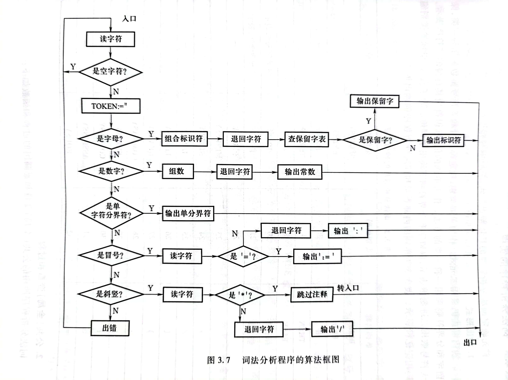

## 架构分析

### 正则表达式的应用

​	对于一个词法分析机 `Lexer` 来说，可以将其视为一个有限状态自动机，但是这个自动机极其复杂，所以可以考虑对于每种 token 分别设计状态机，然后将这些小的状态机并联起来，就可以获得一个完整的状态机，也就是如下结构



​	又因为正则表达式在数学上和一个状态机等价，所以可以用这种形式构造 `Lexer`：

```java
regex1|regex2|regex3|...|regexn
```

​	我的架构相对于这个架构没有首字符判断，而是直接采用正则表达式进行分类，所以需要更加细致的优先级比较。

### 完全的自动机

​	这个问题来自于与肖哥哥的一次讨论的结果，我们讨论的主题是“对于源文件的读入，是处理成一个字符串，还是按照换行分处理成一个字符串数组”。我一开始持“数组观点”。但是后来经过思考，我觉得还是按照一个字符串读入更加具有数学美感。

​	因为除了常见的分类，我们还有一些需要处理的，没有出现在分类中的 `token`，比如空白符，注释。这些东西也可以用一个小的自动机识别，作为一个 `token` 。我们只是不登记它罢了。如果要按照数组的形式去读取，那么就会导致换行符等元素被直接翻译了，这就导致原文本变得不完整了，我们匹配的对象不再是源文件，而是源文件的一行，那么显然多行注释这种东西就没法匹配了。

​	如果按照一个字符串来处理，那么根据要求，就需要一个变量来记录目前到哪一行了，这个很容易，只需要确定一下每次匹配到的内容中有几个 `\n` 即可。

```java
token.getContent().chars().boxed().filter(c -> c == '\n').count();
```

​	这里再提一嘴 `/r/n` 的文字，在 windows 下，我们说的“换行啦”对应的是 `/r/n` 。其中 `/r` 的意思是将光标定位到行首，而 `\n` 是“换行”。但是如果按照正常的理性，那么 `/r/n` 应该是消掉最后一行的意思，但是又因为最后一行的行尾其实本质是下一行的行首，所以 `/r` 在末尾敲的时候，是没有用处的，所以就可以正常工作了。在 Linux 下，“换行啦”对应的是 `\n` 。

### 单词分类与识别

​	这是我在进行架构设计的时候最为纠结的地方，因为要考虑数学的优雅性和上机的易于拓展性。

​	我们需要一个大的自动机去识别多种 `token`，这个目的需要一个很大的正则表达式，有很多个小的正则表达式连缀形成。但是这个的缺点就在于，当这个总的正则匹配上的时候，我并不清楚是哪一个小的表达式匹配上了。

​	对于这个问题，其实有两种思路，一种是放弃简单的**总正则表达式**，而是利用循环结构一个个的去匹配小的正则表达式。我没有采用这种想法，不过现在看起来，这种方法确实是最适合应试的一种方法，因为无论是优先级的设定，还是 `token` 的维护，都是最便捷的，而是实现难度极小（甚至还有一种暴力的数学美感）。但是多次匹配，不知道效率会不会降低。

​	另一个是使用完总表达式匹配完成后，再迭代各种单词的类别，然后确定到底匹配的是哪一个，确定的方法可以利用预先建立好的 `map`，但是其实有一些还是需要正则表达式匹配（数学上是必须的）。不过可以利用正则表达式的**命名组**来去掉这个过程。不过无论如何都避免不了内层的迭代。

​	我采用的是规规矩矩的书上的方法，先给单词进行一个大的分类，然后对于大分类，再写具体的正则。这种方法除了比较容易看懂以外，修改起来既要改大类，又要改小类，我觉得不是很好。为了一点点美感，需要改的地方增多了。

### 匹配的优先级

​	比如说对于字符串 `<=` 。正则表达式 `"<"` 和 `"<="` 都可以匹配上，所以匹配的时候要注意优先级问题，其实只有两点，就是

- 长串优先匹配。这是对应上面描述的情况
- 保留字优先匹配。这是对应 `main1` 和 `main` 都可以匹配的情况。

## 正则表达式

### 转义与正则

我们首先看一段关于转义字符的解释：

> 转义序列通常有两种功能。第一个是编码一个句法上的实体，如设备命令或者无法被字母表直接表示的特殊数据。第二种功能，也叫字符引用，用于表示无法在当前上下文中被键盘录入的字符（如字符串中的回车符），或者在当前上下文中会有不期望的含义的字符（如C语言字符串中的双引号字符"，不能直接出现，必须用转义序列表示）。在后面那种情况，转义序列是一种由转义字符自身和一个被引用的字符组成的一个二合字母（digraph）情形。

我觉得关键点在于两处，即：

- 一个特殊的实体，没法表示的原因：
  - 不好直接表示，比如换行符，总不能打 `enter` 吧
  - 有多重语义，比如对于字符串分界符 `"` ，如果想打印他，就必须 `\"` ，同样的，对于 `\` ，想打印就必须 `\\`
- 二合字母，为了表示他们，我们需要用两个字符来表示，一般第一个字符是 `/`。

如果我们说希望一个字符串是具有转义功能的，那么就是希望它有这种功能 `\n -> enter`。

当我们用 `Java` 写正则表达式的时候，因为正则本身就具有一些转义字符（比 C 要多一些），比如 `\s` 表示空白符，`\w` 表示字母。我们去写的时候，经常出现 `\\n, \\s, \\d` 这种结构，就很让人费解，这个其实可以分成两步理解，以 `\\n` 为例

- 字符串 `\\n` 被处理成了正则表达式 `\n` 。
- 正则表达式 `\n` 对应了“换行” 。

那么如果我们就是想表达一个反斜杠 `\` 和一个 `n` 连续出现，可以用

### 贪婪匹配

正则表达式是默认贪婪匹配的，也就是说 `+, *` 这种符号都是有多少就匹配多少，如果想要让其非贪婪，需要将其替换成 `+?, *?`。 

在编译器中，字符串，多行注释都是需要进行非贪婪匹配的。不然容易导致两个多行注释之间的正文部分被贪婪匹配掉。

### 注释的正则表达

这个 `.` 匹配的是**“匹配除换行符（\n、\r）之外的任何单个字符”**。所以可以用来匹配单行注释而且不发生错误。即

```java
String SINGLE_COMMENT_REGEX = "//.*"
```

对于多行注释，为了可以实现换行功能，我们需要声明是可以匹配换行的

```java
String MULTI_COMMENT_REGEX = "/\*(.|\\n|\\r)*?\*/"
```

### 空白符

`/s` 可以很好的匹配所有空白字符，等价于 `[ \f\n\r\t\v]` 所以我们可以利用他完成换行功能。

### 保留字

对于保留字，易错点是容易将其与**标识符**弄混，可以通过“先匹配保留字，如果匹配不成功，再匹配标识符“的方式解决。

但是这样并不能完全解决问题，因为对于 `main0` 这样的标识符，如果先匹配，会被识别成保留字，所以稳妥一点的方法是加入后缀，避免出问题

```java
"reserved(?![a-zA-Z0-9_])"
```

### 字符串

​	我们的要求是“十进制编码为 32, 33 , 40-126 的 ASCII 字符, `\` (编码92)出现当且仅当为`\n`。或者是字符 `%d` 。为了严谨考虑，这个也是可以用正则表达式表示的，同时主要非贪婪匹配

```java
String PATTERN = "\"([\\x20\\x21\\x28-\\x5b\\x5d-\\x7e]|(\\\\n)|(%d))*?\""
```

### 栈溢出

​	在实现完成后，我发现对于较长的字符串或者注释，很容易栈溢出，所以最终选择手写注释和字符串的状态自动机。

### 其他数制的实现

需要注意的是，`0` 只有一个，由于 `SysY` 应该允许前导零，所以可能到时候再自求多福吧。

```java
intConst
    : DECIMAL_CONST
    | OCTAL_CONST
    | HEXADECIMAL_CONST
    ;

DECIMAL_CONST
    : [1-9]
    | [1-9] [0-9]+
    ;

OCTAL_CONST
    : '0'
    | ('0' [0-7]+)
    ;

HEXADECIMAL_CONST
    : ('0x' | '0X') [a-fA-F0-9]+
    ;

DECIMAL_FLOATING_CONST
    : FRACTIONAL_CONST (('e' | 'E') ('+' | '-')? [0-9]+)?
    | [0-9]+ (('e' | 'E') ('+' | '-')? [0-9]+)
    ;

HEXADECIMAL_FLOATING_CONST
    : ('0x' | '0X') HEXA_FRACTIONAL_CONST (('p' | 'P') ('+' | '-')? [0-9]+)
    | ('0x' | '0X') [a-fA-F0-9]+ (('p' | 'P') ('+' | '-')? [0-9]+)
    ;

FRACTIONAL_CONST
    : ([0-9]+)? DOT [0-9]+
    | [0-9]+ DOT
    ;

HEXA_FRACTIONAL_CONST
    : ([a-fA-F0-9]+)? DOT [a-fA-F0-9]+
    | [a-fA-F0-9]+ DOT
    ;
```

​	对于语义部分，似乎有一些方法辅助转化。

```java
int x = Integer.parseInt(str.substring(2),16);
Double.longBitsToDouble(0x40E01D0280000000L)
```

